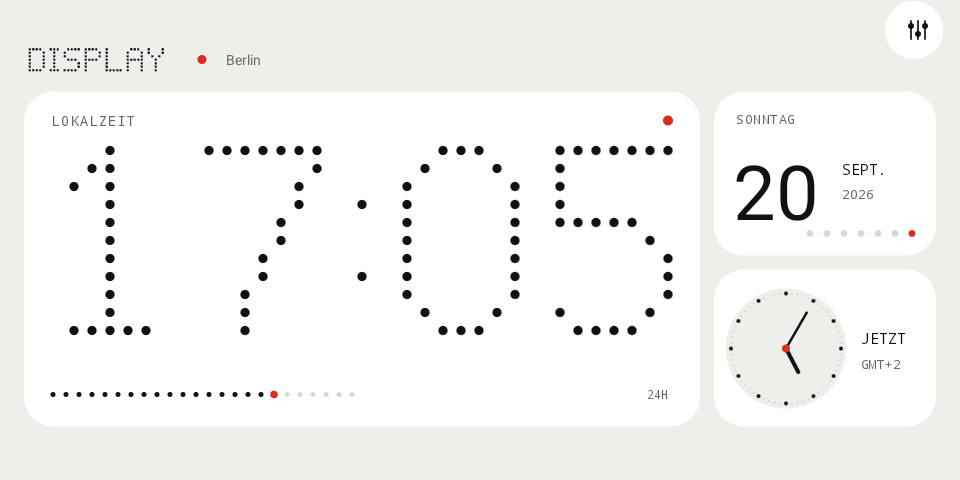
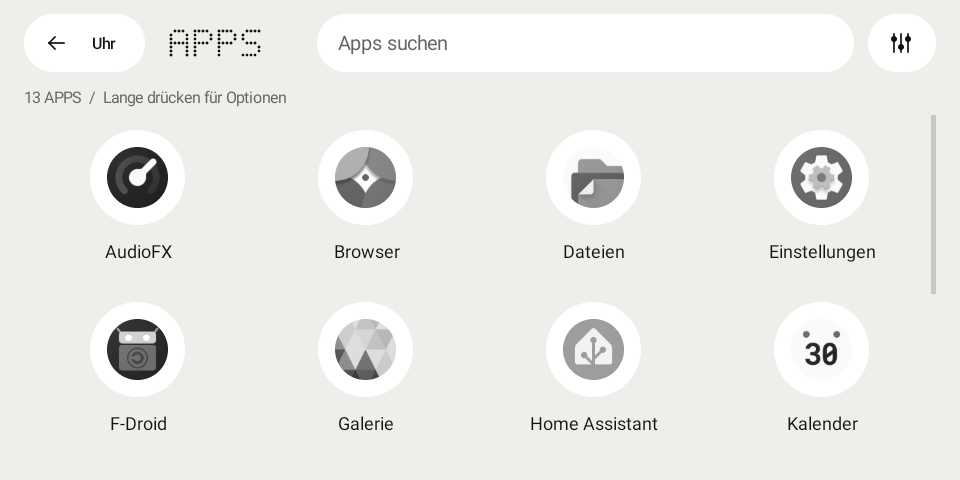
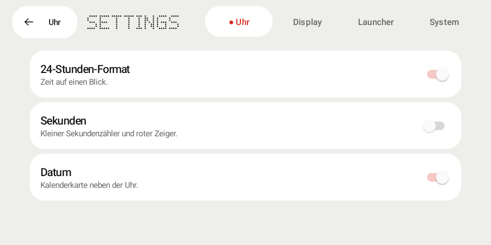

# Display

Display is a small, glanceable clock and Android launcher built specifically for the Echo Show 5 (`checkers`) running LineageOS 18.1. The current release is [v0.1.4](https://github.com/marius4lui/display/releases/tag/v0.1.4).

It replaces a conventional home screen with a readable dot-matrix clock, an ambient-light-aware display, weather, Home Assistant controls, and a fast app drawer. Display does not contain Nothing branding or proprietary Nothing assets.



| Four-column app drawer | Compact, touch-sized settings |
| --- | --- |
|  |  |

See the [design system](docs/DESIGN.md), [installation guide](docs/INSTALL.md), and [0.1.4 verification notes](docs/QA-0.1.4.md).

## Target

- Echo Show 5, device codename `checkers`
- LineageOS 18.1 / Android 11 (API 30)
- 960 × 480 landscape display
- 32-bit ARM (`armeabi-v7a`)

Other Android 11+ devices may work, but are not currently supported.

## Features

- Full-screen 7 × 11 dot-matrix clock, calendar card and analog dial, drawn with Canvas
- White-only design: soft gray canvas, white rounded modules, monochrome icons and restrained red accents
- 12/24-hour time, optional seconds and date; minute-aligned redraws by default
- Ambient light sensor brightness with smoothing and hysteresis
- Keep-awake, optional immersive mode, and a power-button-triggered low-brightness AOD
- Spatial swipe navigation with predictable return gestures, four-column app grid, Android Home role, hidden apps, and safe Quickstep fallback
- Open-Meteo weather without an API key and with an offline cache
- Home Assistant sensors, switches, lights, and climate entities
- Keystore-encrypted Home Assistant token
- GitHub Release update checking with SHA-256 verification
- Two-column setup with scrollable content and fixed navigation for the 960 × 480 touchscreen
- Categorized settings with immediately saved controls

## Navigation

The clock is the center of a three-page spatial layout:

| From | Gesture | Result |
| --- | --- | --- |
| Clock | Swipe right | Apps |
| Apps | Swipe left or right | Clock |
| Clock | Swipe left | Home Assistant |
| Home Assistant | Swipe left or right | Clock |

Every horizontal swipe on a secondary page returns to the clock, while vertical scrolling in the app drawer never changes pages. Use the in-card controls icon or long-press the clock for Settings; Android Back and the **Clock** button return to the clock.

## Always-on display

Enable **Settings → Display → Power button AOD**. The first power press changes to a black, very-low-brightness clock whose position shifts slowly to avoid a permanently static LCD pattern. A second press hands control back to LineageOS sleep/doze; the next wake returns to the full clock. The feature uses a local foreground service and wake lock, not overlay or accessibility access. Android may briefly blank the panel before the app receives the screen-off event.

The clock, Apps, and Home Assistant are immersive smart-display surfaces. Android system bars remain available through an edge swipe. Setup and Settings remain safely inset when fullscreen mode is disabled.

## Install

Download the signed APK and checksum from the [latest GitHub release](https://github.com/marius4lui/display/releases/latest), verify the SHA-256 file, and install it as an in-place update:

```powershell
adb install -r .\display-0.1.4-armv7.apk
adb shell am start -n com.marius4lui.display/.MainActivity
```

`-r` preserves the existing configuration when the installed app uses the same release certificate. See the [full installation guide](docs/INSTALL.md) before selecting Display as the Home app.

## Build

Requirements: JDK 17 or newer and Android SDK 36.

```powershell
.\gradlew.bat lintDebug testDebugUnitTest assembleDebug
adb install -r .\app\build\outputs\apk\debug\app-debug.apk
adb shell am start -n com.marius4lui.display.debug/com.marius4lui.display.MainActivity
```

Debug builds use the separate package `com.marius4lui.display.debug`, so they can be tested beside the signed launcher without replacing its data or Home-role selection.

Additional documentation:

- [Home Assistant setup and network policy](docs/HOME_ASSISTANT.md)
- [Launcher recovery through ADB](docs/ADB_RECOVERY.md)
- [Release process](docs/RELEASE.md)
- [Performance targets](docs/PERFORMANCE.md)

## Privacy

Display has no analytics, advertising, account system, or telemetry. Network access is used only for features explicitly configured by the user. See [docs/PRIVACY.md](docs/PRIVACY.md).

## License

Display is licensed under the GNU General Public License v3.0. See `LICENSE`.
